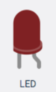

## Lab Week 14: 8/4 - 12/4

The assignment this week constitute the first part of the mandatory project 4 in the course. Project 4 will be made of of three parts

- Part A: Hardware/software co-design of an access control device (lab this week)
- Part B: Connecting IoT devices to the cloud (course week 15)
- Part C: Writing a 5-page report on Parts A and B (course week 16)

### Project 4 - Part A

This part is to be solved using the TinkerCAD: https://www.tinkercad.com/ simulator. Start by creating an account if you do not already have one. If you have an Arduino board yourself, then you may choose to build the actual physical prototype.

#### Sensors

You will be using the following *sensors* with digital input

- A passive infrared-sensor (PID) for detecting the approach of a person (motion)

- Two pushbuttons for entering an entry code - the order is the code.

#### Actuators

You will be using the following actuators with digital output

- Three LEDs (red,yellow,green) for signalling state

#### Functional requirements

The sensors and actuators is to be controlled by software running in the microprocesser. The software is required to implemented the following behaviour

- Initially, the system is in the `LOCKED`.

- The red LED is on when the system is in a `LOCKED` state.

- When motion is detected, the yellow LED must be switched on; and the system is in a state `WAITING` for:

   - The user to do two pushes on the buttons. After each push, the yellow LED should blink shortly.

   - If the order it correct, then system will become `UNLOCKED`, and the green LED is switched on.

   - If the order it not correct, the red LED should blink and the system will go back to a `LOCKED` state

After a certain amount of time in the `UNLOCKED` state, the system should automatically enter the `LOCKED` state.

To simplify the design, you can just hardcode the correct button order in the software.

Test your design and implementation using simulation in TinkerCAD.

**Extra:** Do some research on Arduino programming and find a solution such that if the user has not pushed two buttons within a certain amount of time in the `WAITING` state, then system should go to the `LOCKED` state.

#### Make a finite-state machine model / think before you program

Start the assignment by drawing a [finite state machine](https://en.wikipedia.org/wiki/Finite-state_machine) that shows the states of the system, and the transition that may take place causing the system to change its state. The state machine should be based on the description of the functional requirements above.

The finite-state machine models and a description of it will also be required for Part C - the project report. The figure can be drawn by hand or using a UML tool.

#### Resources

- Arduino language reference https://www.arduino.cc/reference/en
- Arduino board layout https://www.arduino.cc/en/Reference/Board   
- Short demovideo of the input/output example from the lectures https://www.youtube.com/watch?v=1kW8clGpUJQ
- TinkerCAD design and code for the input/output example presented at the lectures https://www.tinkercad.com/things/ki35AdXHyJz
